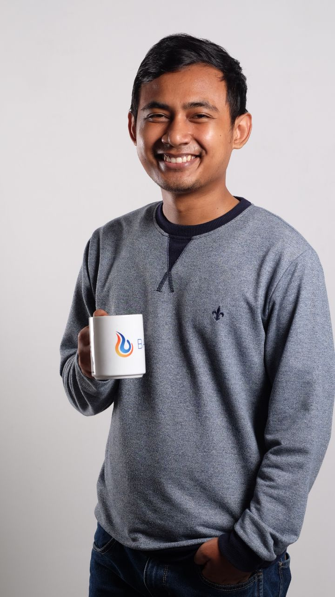

# Welcome

## :man: Personal Information

{ width="130" align="left" }

!!! info "Introduction"
    |                               |                                   |
    |   :-----                      |   :-----                          |
    |   _Name :_                    |   **Roni Setiawan**               |
    |   _Address :_                 |   **Bojong Gede District, Bogor Regency, West Java, Indonesia 16920**  |

## :notepad_spiral: Profesional Summary
!!! quote ""
    I am passionate about Programming since High School when I joined the Informatics Olympiad Team. While learning to code I found joy and excitement.

    My career started in 2017, I have been involved in **Frontend Engineer**, **Backend Engineer**, **DevOps Engineer**, and **Test Automation Engineer**.

    As engineer have made me so familiar with solving unpredictable problem, adapting in a new environment, working in a team and learning something new autodidactly. This makes me constantly learning and evolving.

## :fontawesome-solid-user-graduate: Education
**Bachelor Degree** in **Computer Science** 
**Universitas Lampung**, Indoneisa [:material-cursor-default-click:](https://www.unila.ac.id/ "Click here to visit 'Universitas Lampung'"){target=blank} 
_2012-2016_

## :office: Work Experience

### **:material-office-building-marker: PT Bajau Escorindo**, South Jakarta [:material-cursor-default-click:](https://bajau.com/ "Click here to visit 'PT Bajau Escorindo'"){target=blank}

_"PT Bajau Escorindo with purpose to deliver cost effective, optimize and high performance Open Source software solutions to Enterprise organization in Indonesia. Bajau is able to remove the complexity to propose, running and manage IT infrastructure using Open Source Solution."_

???+ note "1. Test Automation Engineer   April 2020 - Present"

    _:octicons-tasklist-16: Duties as **Test Automation Engineer**:_
    
    - Creating automation script based on scenario requested by client.
    - Testing compatibility on **Desktop**, **Mobile**, & **Cloud Testing**.
    - Perform functionality test with related features.
    - Provide information if found bugs, defects, and kind of to client.
    - Provide testing report according client’s format.
    - Maintain and manage all source code testing related to **SCM**. :fontawesome-brands-gitlab:{ title="On Premise - GitLab" }
    - Support **Marketing Team** by making `Demo Project` based on client requirements. :material-information-outline:{ title="If possible, such as using specific tools, prgramming language" }

???+ note "2. Software Developer & DevOps Engineer   January 2019 - April 2020"

    _:octicons-tasklist-16: Duties as **Software Developer**:_

    - Creating an application to support **Techinal Team** for monthly reporting on several `Linux Servers` owned by client. :simple-linux:{ title="sosreport/sysstat" }
    - Support **Marketing Team** by making design _(mock-up)_, _architecture technology_ and _documents related_ for **Demo Project** to clients.
    - Creating **Web Application** based on _Company's Project_.
    - Maintain and manage all source code application related to **SCM**. :fontawesome-brands-gitlab:{ title="On Premise - GitLab" }
    - Application related additions features and bug fixes.
    - Reporting status of project aplication to **Kanban/ProofHub**.
    - Setting up and managing **virtual mechine** related to application used. :simple-vmware:{ title="On Premise - Virtual Mechine" }
    - Deploy application into **target server** / **virtual mechine**. :simple-vmware:{ title="On Premise - Virtual Mechine" } :material-server:{ title="On Premise - Server" }

    

    _:octicons-tasklist-16: Duties as **DevOps Engineer**:_

    - Setting up and managing **CI Tools**. :fontawesome-brands-gitlab:{ title="On Premise - GitLab CI" } :fontawesome-brands-jenkins:{ title="On Premise - Jenkins" }
    - Setting up and managing repository integrated with CICD. :fontawesome-brands-gitlab:{ title="On Premise - GitLab CI" } :simple-jfrog:{ title="On Premise - JFrog Artifactory" } :material-information-outline:{ title="On Premise - NEXUS Repository" }
    - Creating `pipeline script` to running flow process based on **application-build**.
    - Packaging and versioning result running into `archived file` _(this archived file will be called as artifacts)_. :material-information-outline:{ title="Archived file will called as artifacts. And all artifacts are downloadable" }
    - Uploading `artifacts` into **Repository Manager**. :simple-jfrog:{ title="On Premise - JFrog Artifactory" } :material-information-outline:{ title="On Premise - NEXUS Repository" }
    - Creating `playbook script` :material-information-outline:{ title="If Needed" } for deployment process into target server. :simple-ansible:{ title="On Premise - Ansible" } 
    - Maintain and manage all script related to **SCM** :fontawesome-brands-gitlab:{ title="On Premise - GitLab CI" }
    - Collaborate with cross teams for **Demo Project** to clients.

### **:material-office-building-marker: PT Versa Technology**, South Jakarta [:material-cursor-default-click:](https://versatech.co.id/ "Click here to visit 'PT Versa Technology'"){target=blank}

_"PT Versa Technology is an information technology focused company. We are putting ourself apart from our competitors by providing  information technology innovative as prerequisite for good technology goverments."_

    

???+ note "1. Software Developer   March 2017 – January 2019"
    
    _:octicons-tasklist-16: Duties as **Software  Developer**:_

    - Creating **Web Application** & **Android Application** according to bussiness requirement.
    - Maintain and manage source code to **Source Code Management**. :simple-bitbucket:{ title="Cloud - BitBucket" }
    - Application related addition features and bug fixes.
    - Reporting status of project aplication to **JIRA**. :simple-jira:
    - Handling domain requests for **SSL/HTTPS Certificates**. :material-information-outline:{ title="buy domain, setup domain" }
    - Configure web server for client.

    

## :bookmark: Key Projects

### 1. ATRIS (Advance Transaction Interface System)

|                               |                                   |
|   :-----                      |   :-----                          |
|   _Company :_                 |   **PT Versa Tiket Abadi**        |
|   _Technology :_              |   **Source Code Management (SCM)** :   `BitBucket`    **Frontend** :   `NodeJS`, `VueJS`, `HTML`, `CSS`, `JavaScript`    **Backend** :   `Zend Framework`, `PHP`    **Database & Web Server** :   `MySQL`, `IIS`    **Android** :   `Ionic Framework`   |
|   _Duration :_                |   **January 2018 – January 2019** |

> _ATRIS is multi business system for reservations & payments._

[ATRIS Web Application :fontawesome-solid-desktop:](https://atris.versatiket.co.id/){ target=blank .md-button }
[ATRIS Android Application :simple-android:](https://play.google.com/store/apps/details?id=com.versatech.atris.versatiket){ target=blank .md-button }

### 2. Sosreport Application

|                               |                                   |
|   :-----                      |   :-----                          |
|   _Company :_                 |   **PT Bajau Escorindo**        |
|   _Technology :_              |   **Source Code Management (SCM)** :   `GitLab`    **Frontend** :   `NodeJS`, `VueJS`, `HTML`, `CSS`, `JavaScript`    **Backend** :   `Flask`, `Python`    **Database & Web Server** :   `MongoDB`, `Apache`    **Other Tools** :   `sosreport`, `sysstat`, `SAR Chart`   |
|   _Duration :_                |   **January 2019 – May 2019** |

> _Generating document **Monthly Report** for **Linux Server** (`Ubuntu`, `Centos`, `RedHat`, `SUSE`, `Almalinux`) about **Performance** (`CPU`, `Memory`, `Disk`) & **OS Specification** (`IP Address`,` MAC`, `Processor`, `OS`, `Kernel`). Total around 200 Server Linux._

### 3. OS Hardening - Telkomsel

|                               |                                   |
|   :-----                      |   :-----                          |
|   _Company :_                 |   **Telkomsel**        |
|   _Technology :_              |   **Source Code Management (SCM)** :   `GitLab`    **Hardening Script** :   `Bash`    **Deployment Tools (CD)** :   `Ansible`, `YAML`    **Repository Manager** :   `JFrog Artifactory`    **Other Tools** :   `OpenSCAP`   |
|   _Duration :_                |   **January 2019 – December 2020** |

> _Hardening around 150 VM Server (`RedHat`) based on status `fail`. Result every server store as artifact into **JFrog Artifactory**._

### 4. CICD Telkomsel Phase 2

|                               |                                   |
|   :-----                      |   :-----                          |
|   _Company :_                 |   **Telkomsel**        |
|   _Technology :_              |   **Source Code Management (SCM)** :   `GitLab`    **Continues Inegration (CI)** :   `Jenkins`, `Groovy`, `Bash`    **Deployment Tools (CD)** :   `Ansible`, `YAML`    **Repository Manager** :   `JFrog Artifactory`    **Other Tools** :   `OpenSCAP`   |
|   _Duration :_                |   **January 2019 – December 2020** |

> _Migrating source code application into **GitLab** (`On Promise - Telkomsel`). Onboarding around **13 important application** owned by Telkomsel with **CICD**._

### 5. CCAI Reporting Tools

|                               |                                   |
|   :-----                      |   :-----                          |
|   _Company :_                 |   **Coca Cola Amatil Indonesia**        |
|   _Technology :_              |   **Source Code Management (SCM)** :   `GitLab`    **Web Application** :   `NodeJS`, `Laravel`, `HTML`, `CSS`, `JavaScript`    **Database & Web Server** :   `MariaDB`, `Apache`    **Caching Tools** :   `Redis`    **Other Tools** :   `Qualys`, `Patch Manager Plus`, `Bash`   |
|   _Duration :_                |   **January 2020 – December 2021** |

> _Hardening & Patching around 250 Server (`RedHat`, `SUSE`, `Centos`, `Ubuntu` & `Windows`) based on status `fail`. **Qualys** (Scanning/Scurity Assesment, on both server Linux & Windows), **Patch Manager Plus** (Patching, on both server Linux & Windows), **Bash** (Hardening, on server Linux only)_

### 6. Telkomsel Automation Testing

|                               |                                   |
|   :-----                      |   :-----                          |
|   _Company :_                 |   **Telkomsel**        |
|   _Technology :_              |   **Source Code Management (SCM)** :   `GitLab`    **Test Automation Script** :   `Maven`, `Java`, `Appium`, `Selenium`    **Testing Framework** :   `TestNG`    **Cloud Testing** :   `SeeTest`   |
|   _Duration :_                |   **April 2020 – Present** |

> _Creating testing script on FUT, Inspection and Regression for **MyTelkomsel Application** both `Android` & `iOS`. And 3rd application related (Ex: `MAXStream`, `Dunia Games`, `Viu`, `Prime Video Mobile`, etc)_

### 7. Pengadaan Software Tools Automation Testing Framework Bank Raya

|                               |                                   |
|   :-----                      |   :-----                          |
|   _Company :_                 |   **PT Bank Raya Indonesia Tbk**        |
|   _Technology :_              |   **Source Code Management (SCM)** :   `GitLab`    **Test Automation Script** :   `Python`, `Appium`, `Selenium`    **Testing Framework** :   `Robot Framework`    **Cloud Testing** :   `Lambdatest`    **Software Management Testing** :   `Testmo`   |
|   _Duration :_                |   **May 2023 – Present** |

> _Creating demo project automation testing about **Bank Raya Application** with CICD (integration with Lambdatest & Tesmo)_

## :octicons-graph-16: Technical Skills
- **Programming Languages**: :simple-php: `PHP`, :simple-python: `Python`, :material-language-java: `Java`, :simple-apachegroovy: `Groovy`, `YAML`, :simple-gnubash: `Bash`
- **Web Development**: :material-language-html5: `HTML`, :simple-csswizardry: `CSS`, :simple-javascript: `JavaScript`
- **Frontend Frameworks**: :simple-codeigniter: `CodeIgniter`, :simple-laravel: `Laravel`, :material-vuejs: `VueJS`, :simple-angular: `AngularJS`, :fontawesome-brands-node-js: `NodeJS`
- **Backend Frameworks**: :simple-zendframework: `Zend Framework`, :simple-django: `Django`, :simple-flask: `Flask`
- **Android Framework**: :simple-ionic: `Ionic Framework` _(Hybrid Mobile App Development)_
- **Databases**: :simple-mysql: `MySQL`, :simple-mariadb: `MariaDB`, :simple-postgresql: `PostgreSQL`, :simple-mongodb: `MongoDB`
- **Caching Tools**: :simple-redis: `Redis`
- **Management Project**: :simple-jira: `Jira`, `Kanban`, `ProofHub`
- **Containerization**: :simple-docker: `Docker`
- **CI/CD Tools**: :simple-jenkins: `Jenkins`, :simple-gitlab: `GitLab CI`, :simple-ansible: `Ansible`
- **Web Server**: :simple-apache: `Apache`, `IIS`, :simple-nginx: `NginX`
- **Repository Manager**: :simple-jfrog: `JFrog Artifacory`, `NEXUS Repository`
- **Test Automation**: :simple-selenium: `Selenium`, `Appium`
- **Automation Frameworks**: `TestNG`, :simple-robotframework: `Robot Framework`
- **Cloud Testing**: `SeeTest`, `Lambdatest`
- **Software Management Testing**: `Testmo `
- **Version Control**: :simple-git: `Git`
- **Tools & Technologies**: :material-api: `RESTful API`

## :open_file_folder: Open Source Contributions
- :simple-docker: **Docker Hub** : [Visit my docker profile here!](https://hub.docker.com/u/ronisetiawan){target=blank}
- :simple-gitlab: **GitLab** : [Visit my gitlab profile here!](https://gitlab.com/setiawanroni120){target=blank}
- :simple-github: **GitHub** : [Visit my github profile here!](https://github.com/setiawanroni120){target=blank}

## Online Portofolio
[Portofolio via GitLab :simple-gitlab:](https://setiawanroni120.gitlab.io/portofolio){ target=blank .md-button }
[Portofolio via GitHub :simple-github:](https://setiawanroni120.github.io/portofolio){ target=blank .md-button }